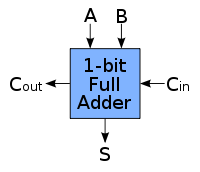

This module explains how to build adder circuits. An **adder** or a **summer** is a digital circuit that performs addition of binary numbers. Adders are used not only in the arithmetic logic units, but also in other parts of the processor, to calculate addresses, table indices, etc. Adder is a simple circuit, but a fundamental one.

